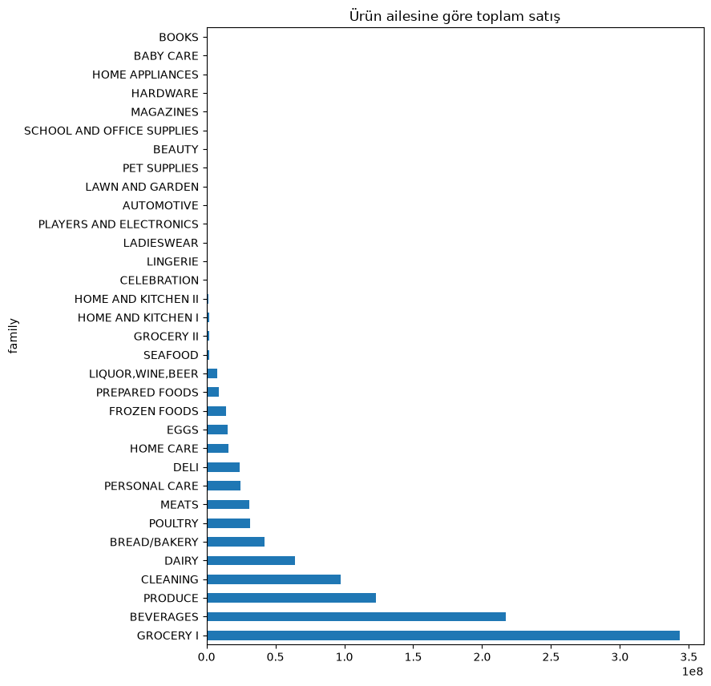
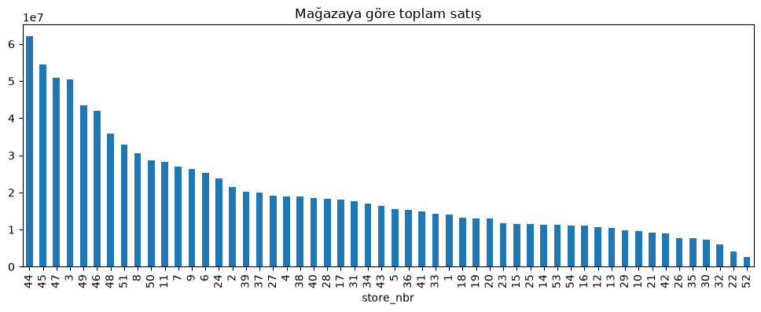
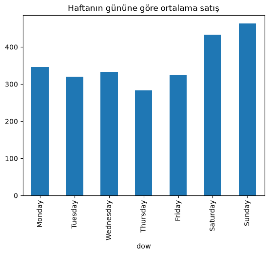

# ML End-to-End: Store Sales Forecasting

## Problem
Corporación Favorita (Ekvador merkezli bir market zinciri) için her
mağaza-ürün ailesi kombinasyonunda günlük satış miktarını tahmin etmek
(zaman serisi tahminleme / time series forecasting).

## Kapsam
- 54 mağaza × 33 ürün ailesi = 1782 ayrı seri
- Daraltma yok, tam kapsam

## Başarı kriteri
- Birincil metrik: **RMSLE** (Root Mean Squared Logarithmic Error) —
  yarışmanın resmi metriği, düşük değer daha iyi
- Baseline karşılaştırması: naif tahmin (geçen haftanın aynı günü) —
  ilk modelin bu baseline'ı ne kadar geçtiğini takip edeceğim

## Veri
- `train.csv` — geçmiş satışlar (tarih, mağaza, ürün ailesi, satış, promosyon)
- `test.csv` — tahmin edilecek dönem
- `stores.csv` — mağaza metadata (şehir, tip, cluster)
- `oil.csv` — günlük petrol fiyatı (Ekvador ekonomisi petrole bağımlı, dış değişken)
- `holidays_events.csv` — tatil/özel gün takvimi
- `transactions.csv` — mağaza başına günlük işlem sayısı

Veri dosyaları Kaggle'dan indirilir ve `data/` klasörüne konur (repoda yer almaz).

## İçindekiler

| Notebook | Konu |
| --- | --- |
| `notebooks/01_eda.ipynb` | Keşifsel analiz: dağılımlar, aile ve mağaza toplamları, hafta günü etkisi, petrol fiyatı |
| `notebooks/02_features.ipynb` | Özellik üretimi: takvim, tatil ve mağaza bilgisi |
| `notebooks/03_leakage_cv.ipynb` | KFold ile TimeSeriesSplit karşılaştırması, sızıntı gösterimi |
| `notebooks/04_split_stratejileri.ipynb` | TimeSeriesSplit, `gap`, GroupKFold ve dağılım kayması |

Özellik üretimi `src/ml_end_to_end/features.py` içindeki `build_features()` fonksiyonundadır.

## Çalıştırma

```
uv sync
```

Sonra VS Code'da notebook'u aç ve kernel olarak projenin `.venv`'ini seç.

## Bulgular

- Satışlar çok çarpık: çoğu değer küçük, çok az sayıda satır 40.000'in üstüne çıkıyor (en yüksek yaklaşık 125.000). Bu yüzden `log1p` dönüşümü ve RMSLE doğal bir seçim.
- GROCERY I ve BEVERAGES en büyük iki ürün ailesi; birçok aile toplamda çok küçük.
- Hafta sonu satışlar daha yüksek (Cumartesi ve Pazar ortalaması hafta içinden belirgin yüksek), Perşembe en düşük.
- Her yılın 1 Ocak'ında toplam satış sıfıra yakın düşüyor.
- Zaman içinde toplam satış genel olarak artıyor; petrol fiyatı 2014 sonundan itibaren düşüyor. İlişki bu grafikten nedensel olarak yorumlanamaz.
- `onpromotion` 2013'te tamamen 0: büyük olasılıkla o dönemde kayıt tutulmuyordu. Yıllara göre promosyonlu satır oranı: 0.000, 0.100, 0.209, 0.351, 0.453.
- Train (≤ 2016-09-12) ve doğrulama dönemi arasında ortalama satış yaklaşık %45 farklı: dağılım kayması var.
- KFold zaman sırasını karıştırdığı için geleceği eğitime katar, `TimeSeriesSplit` bu sızıntıyı önler.


## Görseller

Satış dağılımı (log ölçekli):


Zaman içinde toplam satış ve petrol fiyatı:


Ürün ailesine göre toplam satış:



Mağazaya göre toplam satış:



Hafta gününe göre ortalama satış:




## Yol haritası
- Hf1: EDA, feature engineering, model seçimi/değerlendirme
- Hf4: PyTorch ile deneme, uçtan uca hat, deploy